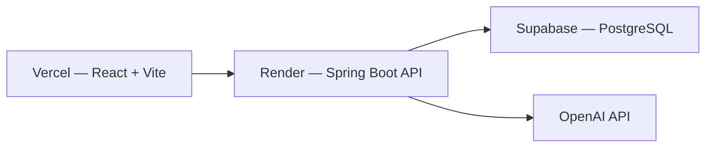

# ClientFlow AI

**Full-stack AI workflow app for freelancers** — turn messy meeting notes into summaries, action items, tasks, and follow-up email drafts.

**Live demo:** [clientflow-ai-xi.vercel.app](https://clientflow-ai-xi.vercel.app)

---

## The problem

Freelancers and consultants lose time after client calls: notes sit in a doc, follow-ups get forgotten, and turning a conversation into tasks and a professional email takes manual effort every time.

There was no single place to manage the client, store the meeting, run AI on the notes, and track what to do next.

## The solution

ClientFlow AI models a real freelancer workflow end to end:

```
Client → Meeting notes → Process with AI → Tasks + email draft → Follow up
```

1. Add a **client** (CRM-style record with status)
2. Paste **raw meeting notes** after a call
3. Click **Process with AI** — get a summary, key points, action items, sentiment, and a follow-up email draft
4. **Tasks** are created automatically from action items; track them on a dedicated tasks page
5. Copy the email draft and send it from your own mail client

I built this as a portfolio piece to show I can identify a workflow problem and ship a complete solution — not just a CRUD demo.

## Architecture



| Layer | Technology |
|-------|------------|
| Frontend | React, Vite, JavaScript, Tailwind CSS, Lucide icons, Framer Motion |
| Backend | Java 21, Spring Boot, Spring Security, JWT |
| Database | PostgreSQL (Supabase) |
| AI | OpenAI API (`gpt-4o-mini`) |
| Deployment | Vercel (frontend) + Render (backend) |

**Data model:** Users own clients; clients have meeting notes; meetings can have one AI analysis; tasks link to clients and optionally to meetings.

## Key features

- **AI meeting assistant** — async processing with loading states, structured output, copy-to-clipboard
- **Client CRM** — create, edit, and track clients with status (New, Active, Waiting, Completed, Archived)
- **Task management** — auto-created from AI action items; filter and update status inline
- **Auth** — register, login, JWT-protected routes; each user sees only their own data

## Live demo

**App:** [https://clientflow-ai-xi.vercel.app](https://clientflow-ai-xi.vercel.app)

**API health:** [https://clientflow-api-3kgj.onrender.com/api/health](https://clientflow-api-3kgj.onrender.com/api/health)

> **Note:** The backend runs on Render's free tier and sleeps after ~15 minutes of inactivity. The first request after sleep can take **30–60 seconds** to wake up. Refresh once if login or AI processing seems slow.

_Demo account and walkthrough coming in a future update._

## User stories

- As a **freelancer**, I want to paste meeting notes after a client call and get a structured summary so I don't re-read messy text later.
- As a **consultant**, I want action items turned into tasks automatically so nothing falls through the cracks.
- As a **solo agency owner**, I want a follow-up email draft I can copy and send without writing from scratch.
- As a **user**, I want one dashboard to see clients, open tasks, and how many meetings I've processed with AI.

## What I learned

**Full-stack flow**
- Forms → REST API → PostgreSQL → UI refresh with optimistic feedback (toasts, loaders)
- JWT auth with protected routes and per-user data scoping

**AI integration**
- Calling OpenAI from Spring Boot with structured JSON parsing
- UX for slow operations: animated loader, error handling, re-process flow
- Showing AI results first and collapsing long original notes so users see the outcome immediately

**Frontend & design**
- Design tokens and reusable Tailwind patterns (`.card`, `.input-base`, gradient utilities)
- Skeleton screens vs spinners for loading states
- Micro-interactions with Framer Motion; consistent visual system across landing and app pages

**Deployment**
- Vercel + Render + Supabase wiring (CORS, env vars, connection pooling limits)
- Production debugging (CORS, cold starts, shared database between local and prod)

## Screenshots

_Screenshots and a short demo GIF coming soon._

Key screens: landing page, dashboard, AI processing loader, analysis panel with summary and email draft.

## Running locally

**Prerequisites:** Java 21, Node.js 18+, Supabase project, OpenAI API key

```bash
# Backend
cd backend
cp .env.example .env   # fill in Supabase + OpenAI credentials
./mvnw spring-boot:run # http://localhost:8080

# Frontend (separate terminal)
cd frontend
npm install
npm run dev            # http://localhost:5173
```

See `.env.example` in each folder for required variables. Full deploy guide: **[DEPLOYMENT.md](./DEPLOYMENT.md)**

## Project structure

```
clientflow-ai/
├── backend/        # Spring Boot REST API
├── frontend/       # React + Vite app
├── render.yaml     # Render deployment config
├── DEPLOYMENT.md   # Step-by-step deploy guide
└── README.md
```

## Future improvements

- Demo account with seed data for zero-friction reviewer access
- Database migrations with Flyway
- Send follow-up emails directly from the app
- Streaming AI responses

## License

Portfolio project — all rights reserved.
